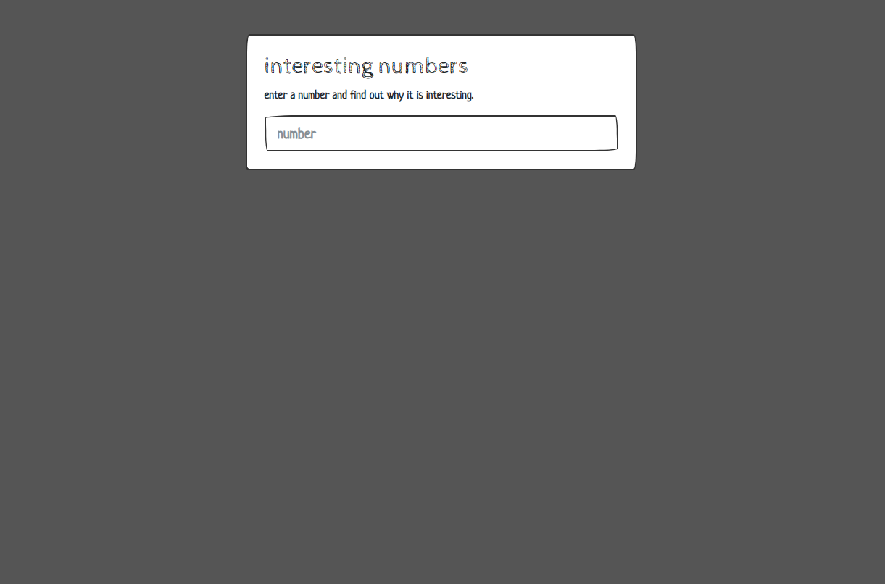

# Interesting Numbers
> The only fun way to make numbers intesting - associating them with fun facts!
## About
### Use
Run index.html in a browser. Try it - [Interesting Numbers](https://mrivasperez.github.io/interesting-numbers/)

## Information
### Author
[Miguel Rivas Perez](https://github.com/mrivasperez)
### Acknowledgements
- Bootswatch for the theme.
### License
This project is licensed under the Unlicense.
> 

## Screenshots

> A screenshot of the application.